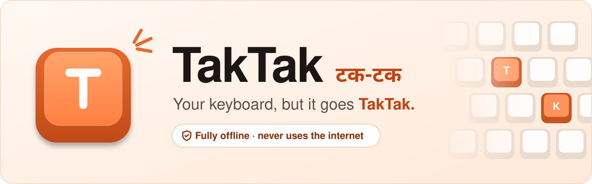
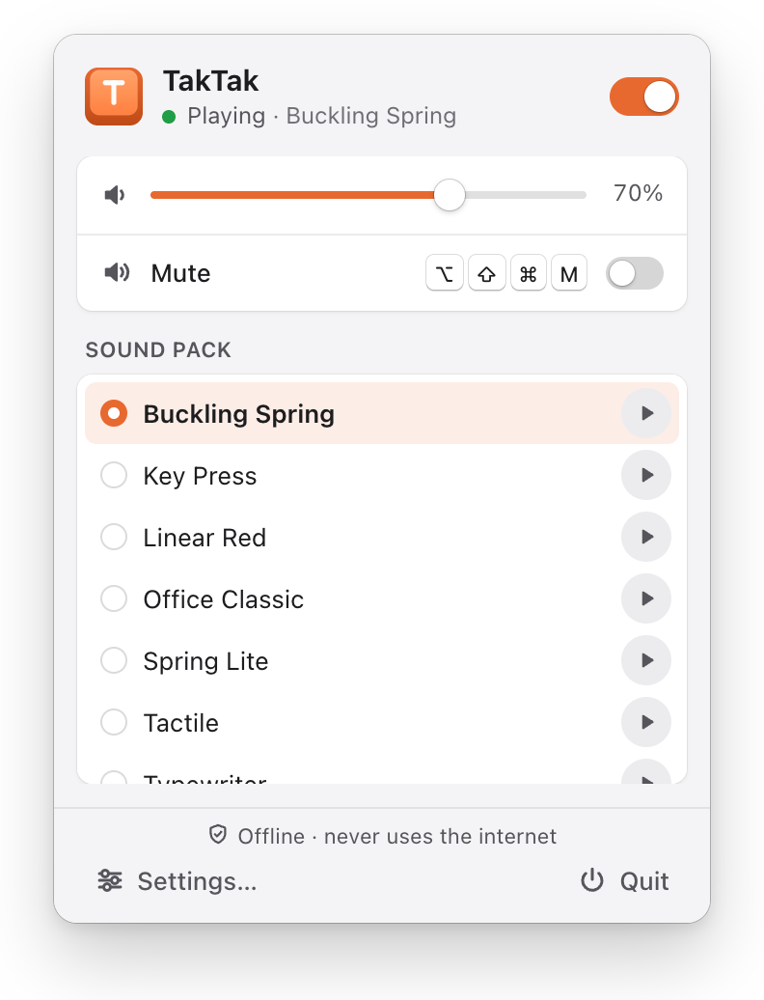
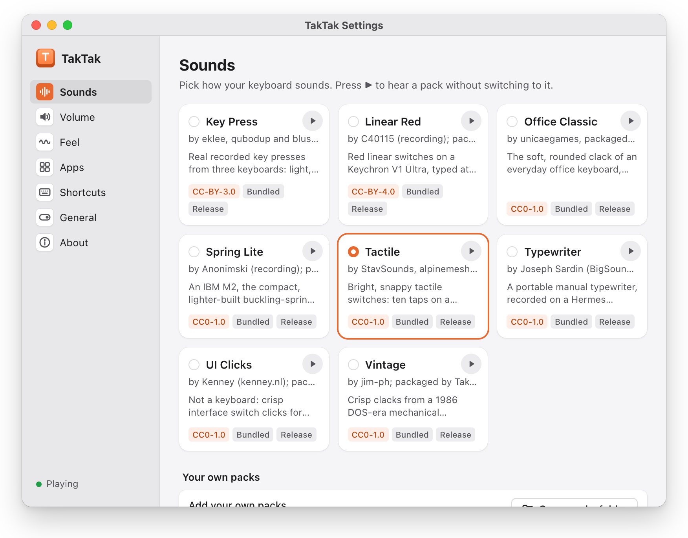
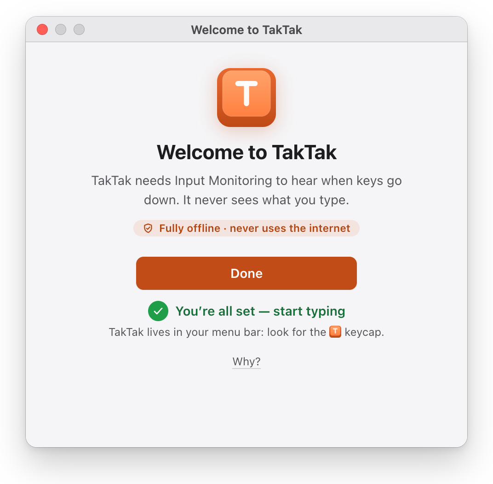
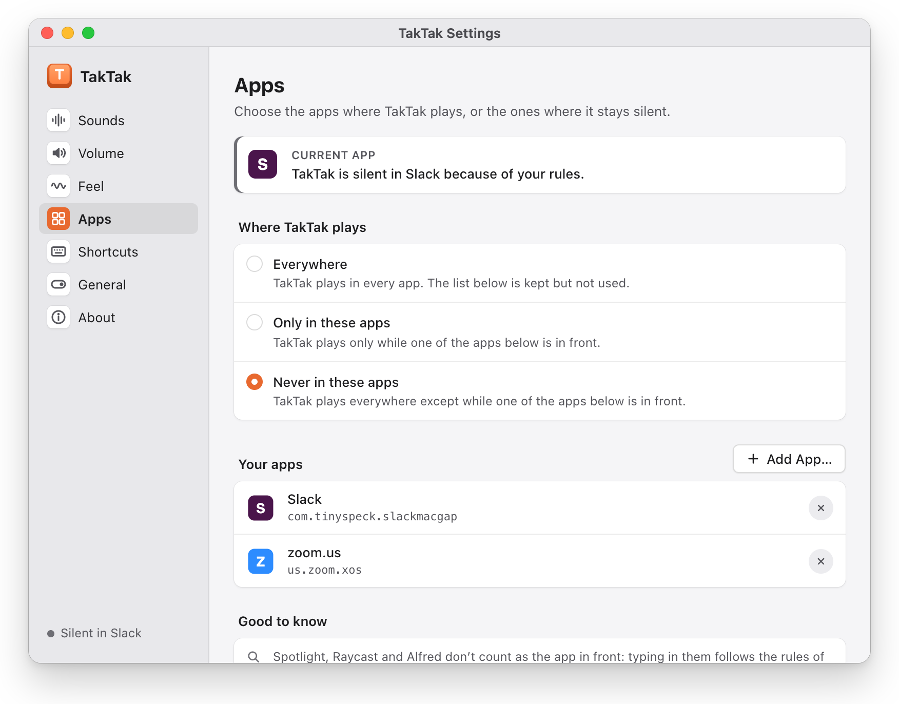
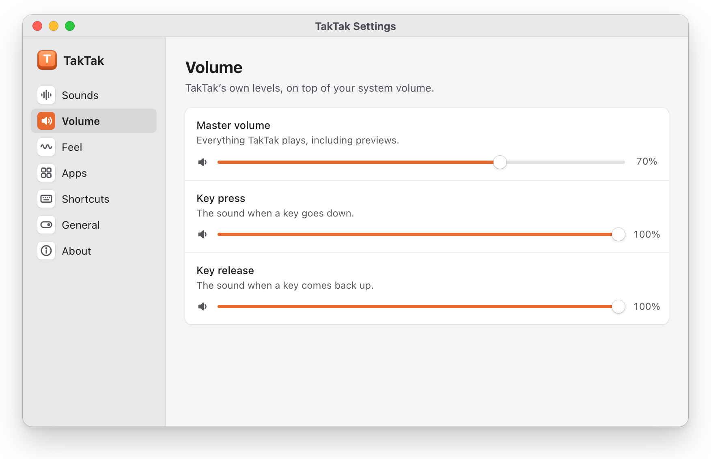
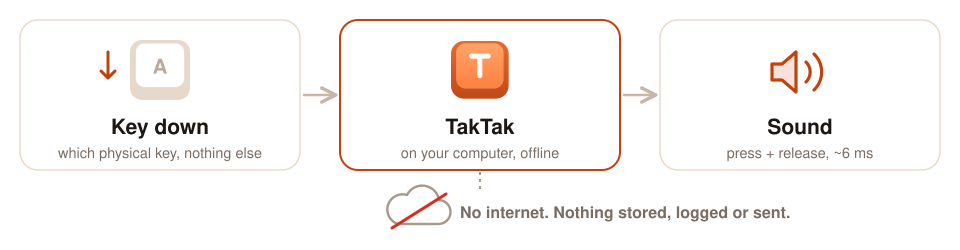

<p align="center">
  <picture>
    <source media="(prefers-color-scheme: dark)" srcset="docs/assets/banner-dark.svg">
    
  </picture>
</p>

<p align="center">
  <a href="https://github.com/mishrabhilash/taktak/actions/workflows/ci.yml"></a>
  <a href="LICENSE"></a>
  <a href="#install"></a>
  <a href="CONTRIBUTING.md#privacy-rules"></a>
</p>

<p align="center">
  <a href="https://github.com/mishrabhilash/taktak/releases"><b>Download</b></a> ·
  <a href="https://mishrabhilash.github.io/taktak/"><b>Website</b></a> (<a href="https://taktak.tech">taktak.tech</a>, hear every pack there) ·
  <a href="#bundled-sound-packs">Sound packs</a> ·
  <a href="#add-your-own-pack">Make your own</a>
</p>

TakTak lives in your menu bar or system tray and plays mechanical keyboard sounds as you type,
in every app, with about 6 ms between the key going down and the click coming out of the
speakers.

<!-- TODO: demo GIF. Record the tray popover switching packs while typing (~10 s, < 3 MB),
     save it as docs/images/demo.gif and add it above the screenshots:
     
     The screenshots are retaken with `node scripts/screenshots.mjs` (see website/README.md). -->
<p align="center">
  <picture><source media="(prefers-color-scheme: dark)" srcset="docs/assets/screenshots/tray-dark.png"></picture>
  <picture><source media="(prefers-color-scheme: dark)" srcset="docs/assets/screenshots/sounds-dark.png"></picture>
  <picture><source media="(prefers-color-scheme: dark)" srcset="docs/assets/screenshots/welcome-dark.png"></picture>
</p>
<p align="center">
  <picture><source media="(prefers-color-scheme: dark)" srcset="docs/assets/screenshots/apps-dark.png"></picture>
  <picture><source media="(prefers-color-scheme: dark)" srcset="docs/assets/screenshots/volume-dark.png"></picture>
</p>
<p align="center"><sub>The popover, Settings → Sounds, the welcome window, per-app rules and the volume
settings (macOS; light or dark follows your system).</sub></p>

> [!IMPORTANT]
> **TakTak is fully offline — it never uses the internet.**
>
> - No network code at all: no accounts, no telemetry, no analytics, no crash reports, no
>   update checks, no downloads. It works the same with Wi-Fi off, forever.
> - **Your keystrokes are never stored, logged or sent anywhere.** TakTak only learns *which
>   physical key* went down or up, plays a sound for it, and forgets it. It never sees the
>   characters you type, never reads your keyboard layout, and has nowhere to send anything.
> - What it saves is your settings, and that's it: nothing about what you type, and nothing
>   about which apps you use beyond the per-app rule list you make yourself. There are no log
>   files.
>
> CI enforces this on every change: the build fails if a networking library, a network API or
> an outside URL shows up in the app (see [CONTRIBUTING.md](CONTRIBUTING.md#privacy-rules)).
> The app says the same, in the same words, in its welcome window, in Settings → About and at
> the bottom of the tray popover.

## How it works

<p align="center">
  <picture>
    <source media="(prefers-color-scheme: dark)" srcset="docs/assets/how-it-works-dark.svg">
    
  </picture>
</p>

A key goes down, the system tells TakTak *which* physical key it was, and TakTak plays that
key's sound from the pack you picked, all on your machine. Nothing in that path touches the
network.

## Why it needs keyboard access

To click when you press a key in *another* app, TakTak has to be told that a key was pressed
anywhere on the system. Operating systems guard that behind a permission because the same
access could be used to record what you type. TakTak uses it for one thing: to know *that* a
key moved and *which* key, so it can pick that key's sound. It does not look at what the key
means, and it keeps nothing (see the box above). On macOS this permission is called **Input
Monitoring**. You can revoke it at any time; TakTak just goes quiet.

## Features

- 🎹 **9 recorded sound packs** bundled, from a buckling-spring board to a typewriter (below).
  Each key gets its own press *and* release sound where the recording has them.
- ⚡ **Low latency**: a dedicated real-time audio path with a 64-frame buffer (numbers below).
- 🎚️ **Tray popover** to switch packs, change the volume, mute, and hear a pack before choosing it.
- ⚙️ **Settings**: master, press and release volume, "humanize" (subtle pitch and volume
  variation), consistent or random sample variants, a global mute hotkey, launch at login.
- 🪟 **Per-app rules** (macOS): sounds everywhere, only in some apps, or never in some apps.
- 🔒 **Auto-mute**: always silent on the lock screen and during fast user switching; optionally
  mutes itself when the output device changes (say, when headphones disconnect in a meeting).
  Password fields are always silent on macOS (Secure Input).
- 📦 **Your own packs**: drop a folder or a `.zip` into the user packs folder and it appears
  within a second, no restart. An open, documented [pack format](docs/pack-format.md).
- 🔁 **Import Mechvibes packs** for personal use (below).
- 🍃 **Light on the system**: the audio stream and the keyboard listener are closed whenever no
  sound can play (sounds off, muted, locked), so the audio device can sleep.

## Install

Download the latest version from **[GitHub Releases](https://github.com/mishrabhilash/taktak/releases)**.
Each release lists `SHA256SUMS.txt` to verify your download.

| OS | File | Notes |
|---|---|---|
| macOS 11 or newer (Apple silicon and Intel) | `TakTak_<version>_universal.dmg` | Open it and drag TakTak to Applications. |
| Windows 10/11 (x64) | `TakTak_<version>_x64_en-US.msi` or `TakTak_<version>_x64-setup.exe` | Either installer works. |
| Linux (x64) | `TakTak_<version>_amd64.AppImage` or `TakTak_<version>_amd64.deb` | AppImage: `chmod +x TakTak_*.AppImage` and run it. Debian/Ubuntu: `sudo apt install ./TakTak_<version>_amd64.deb`. |

> [!NOTE]
> Until code signing is set up, macOS will say it cannot verify the developer: open **System
> Settings → Privacy & Security** and click **Open Anyway** once. Windows SmartScreen may say
> "Windows protected your PC": click **More info → Run anyway**.

### First run and permissions

**macOS: Input Monitoring.** On first launch a welcome window explains the permission and opens
**System Settings → Privacy & Security → Input Monitoring**, where you switch TakTak on (on
macOS 11 and 12: System Preferences → Security & Privacy → Privacy → Input Monitoring, and
click the lock first). TakTak notices the change within two seconds and starts clicking; if
macOS asks, use **Quit & Reopen** in the welcome window. TakTak never shows the macOS prompt
on its own, and it stays silent in password fields and on the lock screen.

**Windows: no permission prompt.** One limit set by Windows itself: TakTak can't hear keys
typed into apps running *as administrator* (an elevated terminal, Task Manager, installers),
unless TakTak were elevated too, which we don't recommend or offer. It is silent there. Keys
typed by on-screen keyboards and automation tools are ignored too.

**Linux: X11 and Wayland differ.**
- **X11**: no extra permission.
- **Wayland** has no way for an app to hear keys typed into other apps, by design. The only
  route is reading the keyboard devices directly, which needs your user in the `input` group
  (`sudo usermod -aG input $USER`, then log out and back in). Be aware that this lets *every*
  program you run read every keystroke, which is why TakTak only explains it, as an explicit
  opt-in, in its welcome window ("Needs keyboard access" until then), and never asks for root.
  Without it, everything but the key sounds works.

> [!NOTE]
> **Platform status.** macOS is the first fully supported and tested platform. Windows and
> Linux have their system-wide key listeners now (a low-level keyboard hook on Windows; XInput2
> on X11 and the input devices on Wayland on Linux), **implemented but not yet verified on real
> hardware**: please report what you find. Per-app rules and the automatic mute on the lock
> screen are macOS only for now. Details: [docs/platform-notes.md](docs/platform-notes.md).

## Bundled sound packs

Every bundled pack is made from real recordings, sliced key by key and level-matched so that
switching packs doesn't jump in volume. Each pack carries its own license; full credits,
changes and provenance are in **[CREDITS.md](CREDITS.md)**.

| Pack | Sounds like | License | Recorded by |
|---|---|---|---|
| **Buckling Spring** (default) | The ping and clack of a classic buckling-spring board, every key sampled down and up | MIT | Ico Doornekamp (bucklespring) |
| **Key Press** | Light, crisp ticks; an older board thumping under Space and the modifiers | CC BY 3.0 | eklee, qubodup, bluszcz |
| **Linear Red** | Fast typing on red linear switches, short letter clacks and a deeper space bar | CC BY 4.0 | C40115 |
| **Office Classic** | The soft, rounded clack of an everyday office membrane keyboard | CC0 | unicaegames |
| **Spring Lite** | A compact, lighter buckling-spring board: bright clicks, softer up-strokes | CC0 | Anonimski |
| **Tactile** | Bright, snappy tactile switches with a separate key-up | CC0 | StavSounds, alpinemesh, yottasounds |
| **Typewriter** | A portable manual typewriter, with a carriage return and bell on Enter | CC0 | Joseph Sardin (BigSoundBank) |
| **UI Clicks** | Not a keyboard: crisp interface clicks and a two-note blip on Enter | CC0 | Kenney |
| **Vintage** | Crisp clacks from a 1986 DOS-era mechanical keyboard | CC0 | jim-ph |

The original authors do not endorse TakTak. Third-party software in the app is listed in
[THIRD_PARTY_NOTICES.md](THIRD_PARTY_NOTICES.md), which ships inside the app next to
`CREDITS.md` and `LICENSE`.

## Add your own pack

A pack is a folder (or a `.zip` of it) with a `pack.json` and some audio files. Put it in the
**user packs folder** and TakTak picks it up within about a second, no restart needed:

| OS | User packs folder |
|---|---|
| macOS | `~/Library/Application Support/tech.taktak.app/packs/` |
| Windows | `%APPDATA%\tech.taktak.app\packs\` |
| Linux | `~/.local/share/tech.taktak.app/packs/` |

A broken pack never breaks TakTak: it is listed with its errors in Settings, and the previous
pack keeps playing.

- **[docs/adding-a-pack.md](docs/adding-a-pack.md)**: step by step, from recordings to a
  validated, level-matched pack, including recording your own keyboard with `pack-maker`.
- **[docs/pack-format.md](docs/pack-format.md)**: the full format specification.

## Import Mechvibes packs

Have packs from Mechvibes? TakTak can convert them to its own format, **for your personal
use**. Most Mechvibes packs don't state a license for their sounds, so treat an imported pack
as yours alone: TakTak marks imported packs `LicenseRef-Personal`. They play normally on your
machine and show a **Personal** badge, but stay there: they can never be bundled or shared.

- **In the app**: **Settings → Sounds → Import Mechvibes pack…** (next to "Open packs
  folder"). Choose the pack's folder (the one with `config.json`) or its `.zip`; on Windows and
  Linux there is a separate "Import pack folder…" button. TakTak converts it into your user
  packs folder, lists it within a second, and shows how many keys it mapped and any notes
  (keys it skipped, missing files). Importing the same pack again offers to replace it. The
  original is not changed.
- **From the command line**: `taktak-import-mechvibes <folder-or-zip>... [--out DIR]
  [--overwrite] [--no-split-release]` converts into the user packs folder by default (the
  running app picks the packs up); `--help` lists the options. From a checkout of this
  repository: `cargo run --release --bin taktak-import-mechvibes -- --help`.
- **Supported formats**: Mechvibes v1 (a single sprite file or one file per key), Mechvibes v2
  (with release sounds and fallbacks), MechvibesDX and Mechvibes++. Sounds may be WAV, Ogg
  Vorbis or MP3. Mouse packs are not imported. Details:
  [docs/pack-format.md](docs/pack-format.md#importing-mechvibes-packs).

Like everything in TakTak, the import runs entirely on your machine.

## Build from source

You need Rust 1.89 or newer, Node 20.19+ or 22.12+ (CI uses 22), and the
[Tauri 2 prerequisites](https://v2.tauri.app/start/prerequisites/) for your OS (Xcode
command line tools on macOS; WebView2 and the MSVC build tools on Windows; WebKitGTK 4.1 and
friends on Linux, the exact list is in [CONTRIBUTING.md](CONTRIBUTING.md#linux-packages)).

```sh
git clone https://github.com/mishrabhilash/taktak.git
cd taktak
npm ci                    # the UI's dependencies, pinned by package-lock.json
npm run tauri dev         # run the app in development, with hot reload for the UI
npm run app               # macOS: a release TakTak.app, signed with a stable identity
npm run release           # installers for this OS (.dmg, .msi/.exe, .AppImage/.deb)
cargo test --workspace    # the Rust tests
npm test                  # the UI and script tests
```

`npm run app` (macOS) builds `target/release/bundle/macos/TakTak.app` and signs it with a
self-signed **TakTak Development** certificate when you have one, so Input Monitoring
survives rebuilds; how to create it is in [docs/app.md](docs/app.md#development-signing).
`npm run release` builds every installer configured for your OS and removes your file paths
from the binary; use it for anything you hand to others. Everything else, including
the self-test, where files live and measurements, is in [docs/app.md](docs/app.md). The
design is in [docs/architecture.md](docs/architecture.md).

## Latency

Measured key-down to sound on a MacBook Pro, built-in keyboard and speakers, 64-frame buffer:

| Path | Median | 95th percentile |
|---|---|---|
| Real typing, end to end (100 presses after warm-up) | 5.9 ms | 6.7 ms |
| Audio path only (trigger to speaker) | 5.4 ms | 6.0 ms |

For comparison, a 128-frame buffer measures 8.1 ms and the device default (512 frames) 20 ms
on the audio path alone. On Windows, the shared audio mode makes it typically 15–30 ms;
Bluetooth headphones add 100–250 ms on any OS, which no app can avoid. Idle CPU is about
0.3 % while sounds are on and 0 % while off. Method and more figures:
[docs/architecture.md](docs/architecture.md#measured-milestone-1-macbook-pro-speakers-441-khz).

## Contributing

Bug reports, packs and code are welcome. Start with [CONTRIBUTING.md](CONTRIBUTING.md): the
gates, code style, the privacy rules every change must keep, and what a pack needs to be
bundled.

## License

TakTak's code is released under the [MIT License](LICENSE). The bundled sound packs are
**individually licensed** (MIT, CC BY 3.0, CC BY 4.0 or CC0; see [CREDITS.md](CREDITS.md) and
the `LICENSE.txt` and `SOURCES.md` in each pack folder). Third-party software:
[THIRD_PARTY_NOTICES.md](THIRD_PARTY_NOTICES.md).

Website: [taktak.tech](https://taktak.tech) (also at
[mishrabhilash.github.io/taktak](https://mishrabhilash.github.io/taktak/)). Its source is the static page in [`website/`](website/)
(no build step, no trackers, and you can hear every bundled pack there); how to preview and
deploy it is in [website/README.md](website/README.md).
